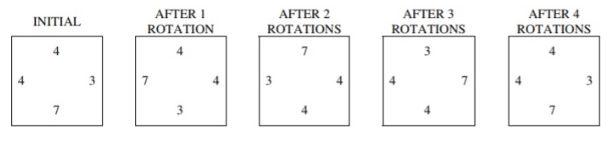
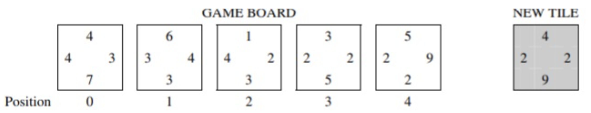

# NumberTile Game  
  
A game uses square tiles that have numbers on their sides. Each tile is labeled with a number on each of its four sides and may be rotated clockwise, as illustrated below.



The tiles are represented by the `NumberTile` class, as given below:

* **NumberTile Class:**
```java
public class NumberTile {

    /**
     * Rotates the tile 90 degrees clockwise
     */
    public void rotate() {
        /* implementation not shown */
    }

    /**
     * @return value at left edge of tile
     */
    public int getLeft() {
        /* implementation not shown */
    }

    /**
     * @return value at right edge of tile
     */
    public int getRight() {
        /* implementation not shown */
    }

    // There may be instance variables, constructors, and methods that are not shown.
}
```
  
## Game Mechanics  
  
Tiles are placed on a game board so that the adjoining sides of adjacent tiles have the same number. The following figure illustrates an arrangement of tiles and shows a new tile that is to be placed on the game board.  



- In its original orientation, the new tile can be inserted between the tiles at positions 2 and 3 or between the tiles at positions 3 and 4.  
- If the new tile is rotated once, it can be inserted before the tile at position 0 or after the tile at position 4.  
- Assume that the new tile, in its original orientation, is inserted between the tiles at positions 2 and 3. As a result, the tiles at positions 3 and 4 are moved one location to the right, and the new tile is inserted at position 3.  
  
## TileGame Class Methods  
  
### Method: `getIndexForFit`  
  
This method determines where a given tile, in its current orientation, fits on the game board. A tile can be inserted at either end of a game board or between two existing tiles if the side(s) of the new tile match the adjacent side(s) of the tile(s) currently on the game board.  
  
- If there are no tiles on the game board, the position for the insert is 0.  
- The method returns the position that the new tile will occupy on the game board after it has been inserted.  
- If the given tile does not fit anywhere on the game board, the method returns -1.  
  
### Example  
  
For example, the call `getIndexForFit(tile1)` can return either 3 or 4 because `tile1` can be inserted between the tiles at positions 2 and 3, or between the tiles at positions 3 and 4. The call `getIndexForFit(tile2)` returns -1 because `tile2`, in its current orientation, does not fit anywhere on the game board.  
  
### Method: `insertTile`  
  
This method attempts to insert the given tile on the game board.  
  
- Returns `true` if the tile is inserted successfully.  
- Returns `false` only if the tile cannot be placed on the board in any orientation.  
- Assume that `getIndexForFit` works as specified, regardless of the implementation.  
  
### Implementation Details  
  
- Part A: Complete method `getIndexForFit`.  
- Part B: Complete method `insertTile`.  
  
