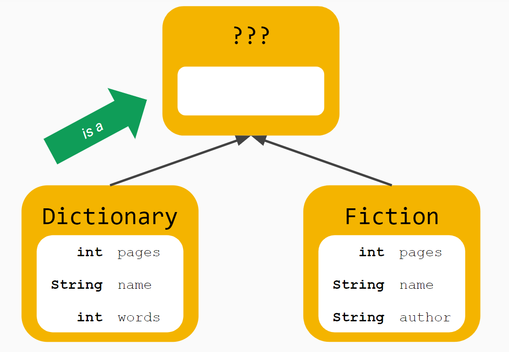

# Instructions

For this activity, you are going to create a `Book` superclass and use inheritance to *refactor* the `Dictionary` and `Fiction` subclasses.

> **Refactoring** is the process of restructuring code, while not changing its original functionality. The goal of refactoring is to improve internal code by making many small changes without altering the code's external behavior. 

Currently the `Dictionary` and `Fiction` classes have instance variables and getter and setter methods. 

## The Goal

Move common **attributes** *and* **methods** to the `Book` superclass and remove them from the subclasses.

> Note: You do not need a constructor in any class.

## Task 1 - Testing the classes

Test the `Fiction` class by doing the following in the `main` method of `Main.java`:

1. Create a `Fiction` object
2. set the object's pages using the `setPages` method
3. set the title of the object using the `setTitle` method
4. set the author of the object using the `setAuthor` method
5. Use the appropriate **accessor** methods to print each instance varable to the console in order to confirm everything works.

Next, test out the `Dictionary` class by doing the following in the `main` method:

1. Create a `Dictionary` object
2. set the object's pages using the `setPages` method
3. set the title of the object using the `setTitle` method
4. set the number of words in the object using the `setWords` method.
5. Use the appropriate **accessor** methods to print each instance varable to the console in order to confirm everything works.

## Task 2 - Create the Book class

In the `Book.java` file, create a `Book` class that *combines* any duplicated instance variables and methods from the `Fiction` and `Dictionary` classes.



## Task 3 - Refactoring

### Declaring a superclass

In order to use the `Book` class as a superclass, you'll need to **inherit** the `Book` class is its subclasses.

Modify the class headers of the `Fiction` and `Dictionary` classes as follows:

```java
public class Fiction extends Book
```

```java
public class Dictionary extends Book
```

This now makes `Book` a **superclass** and all of the instance variables and attributes are inherited.

### Removing duplicated code

Since you inherit the methods and attributes from the `Book` class, you can now delete the duplicated code in the `Fiction` and `Dictionary` classes. This should be the same code you used to create the `Book` class from earlier.

## Task 4 - Test the code

Run your code again, and if everything works correctly, you should still see the same results as before.

# How'd you do?

Compare your final classes with what is shown below:

<details>
  <summary>Click to show Main class</summary>

  ### Main.java
  ```java
  public class Main {
      public static void main(String[] args) {
          Fiction hungerGames = new Fiction();

          hungerGames.setPages(374);
          hungerGames.setTitle("The Hunger Games");
          hungerGames.setAuthor("Suzanne Collins");
          
          System.out.println(hungerGames.getPages());
          System.out.println(hungerGames.getTitle());
          System.out.println(hungerGames.getAuthor());

          Dictionary websters = new Dictionary();
          websters.setPages(720);
          websters.setTitle("Webster's Dictionary");
          websters.setWords(171476);

          System.out.println(websters.getPages());
          System.out.println(websters.getTitle());
          System.out.println(websters.getWords());
      }
  }

  ```

</details>


<details>
  <summary>Click to show Book class</summary>

  ### Book.java
  ```java
  public class Book {
      private int pages;
      private String title;

      public void setPages(int pages) {
          this.pages = pages;
      }

      public void setTitle(String title) {
          this.title = title;
      }

      public int getPages() {
          return pages;
      }

      public String getTitle() {
          return title;
      }
  }

  ```

</details>
<details>
  <summary>Click to show Fiction class</summary>

  ### Fiction.java
  ```java
  public class Fiction extends Book {
      private String author;

      public void setAuthor(String author) {
            this.author = author;
      }

      public String getAuthor() {
          return author;
      }
  }

  ```

</details>
<details>
  <summary>Click to show Dictionary class</summary>

  ### Dictionary.java
  ```java
  public class Dictionary extends Book {
      private int words;

      public void setWords(String words) {
            this.words = words;
      }

      public String getWords() {
          return author;
      }
  }

  ```

</details>
